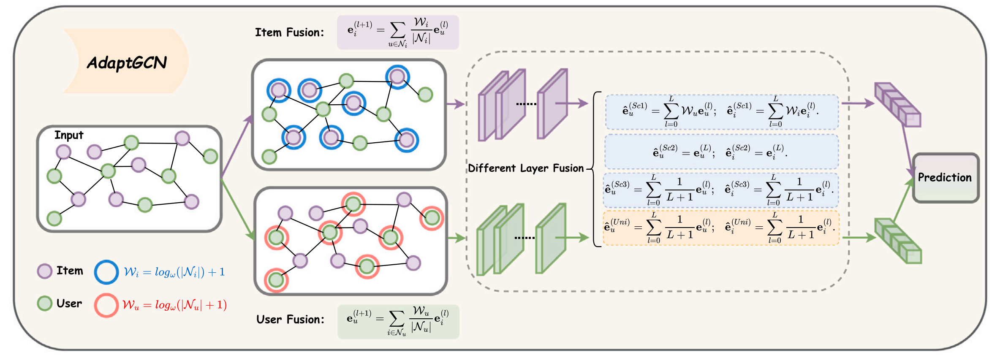








Hello, I am Chenglong Pang. I am a currently master's student at the School of Computer Science and Technology, Donghua University. Interestingly, I have an interdisciplinary background.  I completed my undergraduate studies in Big Data Management and Application at the School of Management, Guangdong University of Technology.

My research interests focus on graph learning, recommender system. Recently, I have been concentrating on the application of AI models in recommendation systems:  
(1) Utilize AI to understand user intentions in recommendation scenarios;  
(2) Behavior-based user personality simulation generation.

# 🔥 News
- *2025.02.24*: &nbsp;🎉 A paper about graph convolutional network recommendation model was accepted by Information Fusion(IF=15.5)!

# 📝 Publications 

Information Fusion 2025(SCI I, IF=15.5)

[Rethinking information fusion: Achieving adaptive information throughput and interaction pattern in graph convolutional networks for collaborative filtering](https://www.sciencedirect.com/science/article/pii/S156625352500123X)

Jiaxin Wu, **Chenglong Pang**, Guangxiong Chen, Jihong Wan, Xiaocao Ouyang, Jie Zhao*
*Corresponding Author

[**Project**](https://www.sciencedirect.com/science/article/pii/S156625352500123X) <strong></strong>
- Accepted by Information Fusion 2025(**IF=15.5 中科院一区Top**). 

# 🎖 Honors and Awards
- *2024.07* The undergraduate graduation thesis won the Excellent Innovation Award. 

# 📖 Educations
- *2024.09 -   now  *, Lorem ipsum dolor sit amet, consectetur adipiscing elit. Vivamus ornare aliquet ipsum, ac tempus justo dapibus sit amet. 
- *2020.09 - 2024.07*, School of Management, Guangdong University of Technology, Guangzhou, China.
  - Major: Big Data Management and Application  

# 💬 Invited Talks
- *2021.06*, Lorem ipsum dolor sit amet, consectetur adipiscing elit. Vivamus ornare aliquet ipsum, ac tempus justo dapibus sit amet. 
- *2021.03*, Lorem ipsum dolor sit amet, consectetur adipiscing elit. Vivamus ornare aliquet ipsum, ac tempus justo dapibus sit amet.  \| [\[video\]](https://github.com/)

# 💻 Internships
- *2019.05 - 2020.02*, [Lorem](https://github.com/), China.
